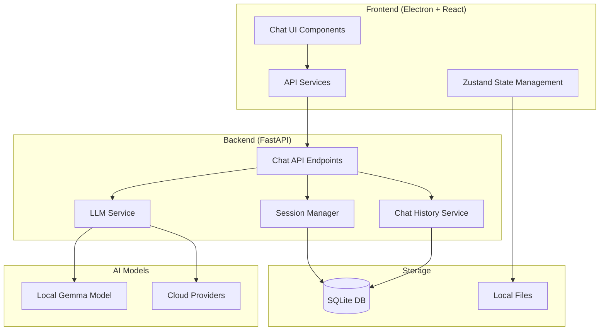
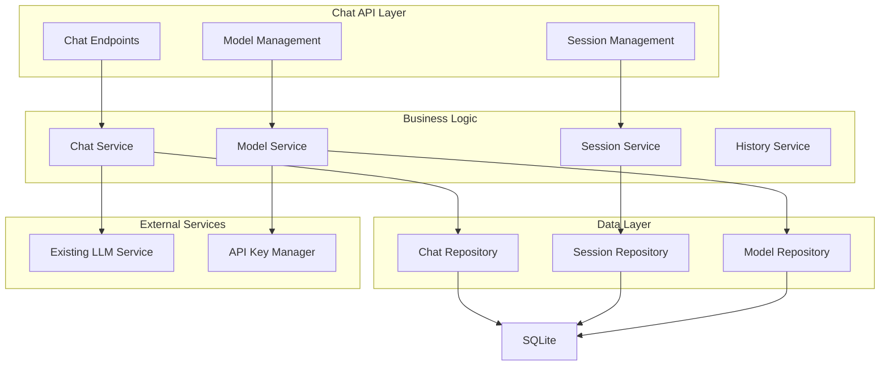
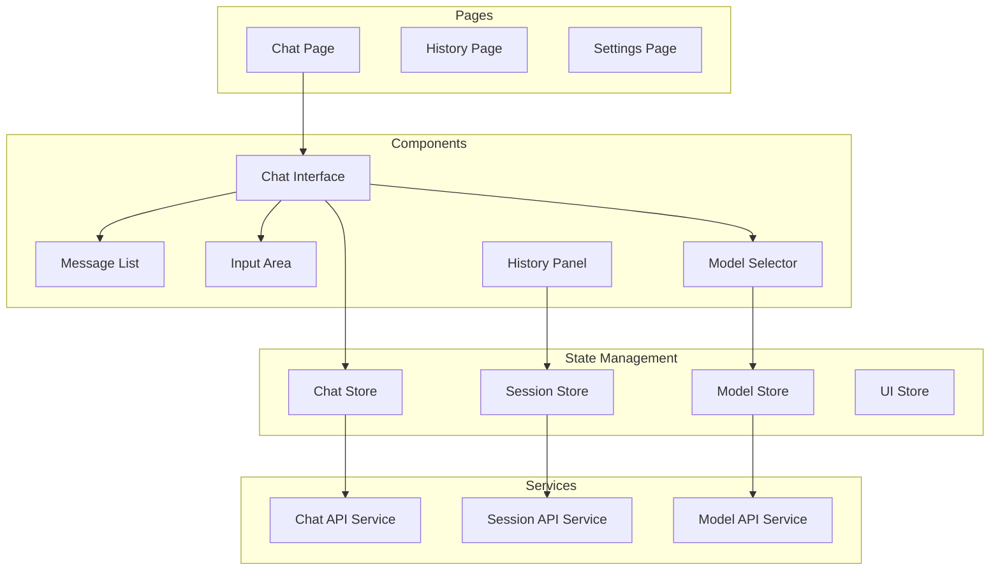

# מסמך עיצוב - מערכת שיחות AI

## סקירה כללית

מערכת שיחות AI מתקדמת הבנויה על הארכיטקטורה הקיימת של Audio Chat Studio. המערכת תשלב את מודל Gemma המקומי כברירת מחדל עם תמיכה בספקי cloud נוספים. העיצוב מתבסס על הפרדה ברורה בין Backend (Python/FastAPI) ו-Frontend (React/Electron) עם דגש על ביצועים, אבטחה וחוויית משתמש מעולה.

## ארכיטקטורה

### ארכיטקטורה כללית



### Backend Architecture



### Frontend Architecture



## רכיבים וממשקים

### Backend Components

#### 1. Chat Service
```python
class ChatService:
    def __init__(self, llm_service: LLMService, session_service: SessionService):
        self.llm_service = llm_service
        self.session_service = session_service
    
    async def send_message(self, session_id: str, message: str, user_id: str = None) -> ChatResponse:
        """שליחת הודעה וקבלת תשובה מהמודל"""
        
    async def stream_message(self, session_id: str, message: str, user_id: str = None) -> AsyncGenerator[str, None]:
        """שליחת הודעה עם streaming response"""
        
    def get_conversation_context(self, session_id: str, max_messages: int = 10) -> List[Message]:
        """קבלת הקשר השיחה האחרונה"""
```

#### 2. Session Service
```python
class SessionService:
    def create_session(self, title: str = None, model_id: str = None, user_id: str = None) -> ChatSession:
        """יצירת session חדש"""
        
    def get_session(self, session_id: str) -> Optional[ChatSession]:
        """קבלת session לפי ID"""
        
    def list_user_sessions(self, user_id: str = None, limit: int = 50) -> List[ChatSession]:
        """רשימת sessions של משתמש"""
        
    def update_session(self, session_id: str, **updates) -> bool:
        """עדכון session"""
        
    def delete_session(self, session_id: str) -> bool:
        """מחיקת session"""
```

#### 3. Chat History Service
```python
class ChatHistoryService:
    def save_message(self, session_id: str, message: Message) -> str:
        """שמירת הודעה בהיסטוריה"""
        
    def get_session_messages(self, session_id: str, limit: int = None, offset: int = 0) -> List[Message]:
        """קבלת הודעות של session"""
        
    def search_messages(self, query: str, user_id: str = None, session_id: str = None) -> List[Message]:
        """חיפוש בהודעות"""
        
    def export_session(self, session_id: str, format: str = "json") -> str:
        """ייצוא session לפורמט מסוים"""
```

### Frontend Components

#### 1. Chat Interface Component
```typescript
interface ChatInterfaceProps {
  sessionId?: string;
  onSessionChange?: (sessionId: string) => void;
}

export const ChatInterface: React.FC<ChatInterfaceProps> = ({
  sessionId,
  onSessionChange
}) => {
  // Chat interface logic
  return (
    <div className="chat-interface">
      <MessageList sessionId={sessionId} />
      <InputArea onSendMessage={handleSendMessage} />
      <ModelSelector />
    </div>
  );
};
```

#### 2. Message List Component
```typescript
interface MessageListProps {
  sessionId: string;
  autoScroll?: boolean;
}

export const MessageList: React.FC<MessageListProps> = ({
  sessionId,
  autoScroll = true
}) => {
  // Message list logic with virtual scrolling
  return (
    <div className="message-list">
      {messages.map(message => (
        <MessageBubble key={message.id} message={message} />
      ))}
    </div>
  );
};
```

#### 3. Input Area Component
```typescript
interface InputAreaProps {
  onSendMessage: (message: string) => void;
  disabled?: boolean;
  placeholder?: string;
}

export const InputArea: React.FC<InputAreaProps> = ({
  onSendMessage,
  disabled = false,
  placeholder = "הקלד הודעה..."
}) => {
  // Input area with markdown support and shortcuts
  return (
    <div className="input-area">
      <textarea />
      <div className="input-controls">
        <Button onClick={handleSend}>שלח</Button>
      </div>
    </div>
  );
};
```

## מודלי נתונים

### Chat Session Model
```python
@dataclass
class ChatSession:
    id: str
    title: str
    model_id: str
    user_id: Optional[str]
    created_at: datetime
    updated_at: datetime
    message_count: int
    is_archived: bool = False
    metadata: Dict[str, Any] = field(default_factory=dict)
    
    def to_dict(self) -> Dict[str, Any]:
        return {
            "id": self.id,
            "title": self.title,
            "model_id": self.model_id,
            "user_id": self.user_id,
            "created_at": self.created_at.isoformat(),
            "updated_at": self.updated_at.isoformat(),
            "message_count": self.message_count,
            "is_archived": self.is_archived,
            "metadata": self.metadata
        }
```

### Message Model
```python
@dataclass
class Message:
    id: str
    session_id: str
    role: str  # "user", "assistant", "system"
    content: str
    timestamp: datetime
    model_id: Optional[str] = None
    tokens_used: Optional[int] = None
    response_time: Optional[float] = None
    metadata: Dict[str, Any] = field(default_factory=dict)
    
    def to_dict(self) -> Dict[str, Any]:
        return {
            "id": self.id,
            "session_id": self.session_id,
            "role": self.role,
            "content": self.content,
            "timestamp": self.timestamp.isoformat(),
            "model_id": self.model_id,
            "tokens_used": self.tokens_used,
            "response_time": self.response_time,
            "metadata": self.metadata
        }
```

### Chat Response Model
```python
@dataclass
class ChatResponse:
    content: str
    model_id: str
    tokens_used: int
    response_time: float
    success: bool
    error_message: Optional[str] = None
    metadata: Dict[str, Any] = field(default_factory=dict)
    
    def to_dict(self) -> Dict[str, Any]:
        return {
            "content": self.content,
            "model_id": self.model_id,
            "tokens_used": self.tokens_used,
            "response_time": self.response_time,
            "success": self.success,
            "error_message": self.error_message,
            "metadata": self.metadata
        }
```

## טיפול בשגיאות

### Backend Error Handling
```python
class ChatError(Exception):
    """Base exception for chat-related errors"""
    pass

class SessionNotFoundError(ChatError):
    """Session not found error"""
    pass

class ModelNotAvailableError(ChatError):
    """Model not available error"""
    pass

class RateLimitExceededError(ChatError):
    """Rate limit exceeded error"""
    pass

# Error handling middleware
@app.exception_handler(ChatError)
async def chat_error_handler(request: Request, exc: ChatError):
    return JSONResponse(
        status_code=400,
        content={
            "success": False,
            "error": str(exc),
            "error_type": exc.__class__.__name__
        }
    )
```

### Frontend Error Handling
```typescript
interface ErrorState {
  hasError: boolean;
  errorMessage: string;
  errorType: string;
  retryCount: number;
}

export const useChatError = () => {
  const [errorState, setErrorState] = useState<ErrorState>({
    hasError: false,
    errorMessage: '',
    errorType: '',
    retryCount: 0
  });

  const handleError = (error: Error) => {
    setErrorState({
      hasError: true,
      errorMessage: error.message,
      errorType: error.name,
      retryCount: errorState.retryCount + 1
    });
  };

  const clearError = () => {
    setErrorState({
      hasError: false,
      errorMessage: '',
      errorType: '',
      retryCount: 0
    });
  };

  return { errorState, handleError, clearError };
};
```

## אסטרטגיית בדיקות

### Backend Testing
```python
# Unit Tests
class TestChatService:
    def test_send_message_success(self):
        """Test successful message sending"""
        
    def test_send_message_with_invalid_session(self):
        """Test message sending with invalid session"""
        
    def test_stream_message(self):
        """Test streaming message response"""

# Integration Tests
class TestChatAPI:
    def test_chat_endpoint_integration(self):
        """Test full chat flow through API"""
        
    def test_session_management_integration(self):
        """Test session management through API"""
```

### Frontend Testing
```typescript
// Component Tests
describe('ChatInterface', () => {
  test('renders chat interface correctly', () => {
    render(<ChatInterface />);
    expect(screen.getByRole('textbox')).toBeInTheDocument();
  });

  test('sends message on button click', async () => {
    const mockSendMessage = jest.fn();
    render(<ChatInterface onSendMessage={mockSendMessage} />);
    
    const input = screen.getByRole('textbox');
    const sendButton = screen.getByText('שלח');
    
    fireEvent.change(input, { target: { value: 'Test message' } });
    fireEvent.click(sendButton);
    
    expect(mockSendMessage).toHaveBeenCalledWith('Test message');
  });
});

// Store Tests
describe('ChatStore', () => {
  test('updates messages correctly', () => {
    const store = useChatStore.getState();
    const message = { id: '1', content: 'Test', role: 'user' };
    
    store.addMessage(message);
    
    expect(store.messages).toContain(message);
  });
});
```

## אבטחה ופרטיות

### Data Encryption
```python
class SecureChatStorage:
    def __init__(self, encryption_key: str):
        self.cipher = Fernet(encryption_key.encode())
    
    def encrypt_message(self, content: str) -> str:
        """Encrypt message content"""
        return self.cipher.encrypt(content.encode()).decode()
    
    def decrypt_message(self, encrypted_content: str) -> str:
        """Decrypt message content"""
        return self.cipher.decrypt(encrypted_content.encode()).decode()
```

### API Key Security
```python
# API keys are already handled by the existing APIKeyManager
# Additional security measures for chat sessions:

class ChatSecurityService:
    def validate_session_access(self, session_id: str, user_id: str) -> bool:
        """Validate user access to session"""
        
    def sanitize_message_content(self, content: str) -> str:
        """Sanitize message content for security"""
        
    def rate_limit_check(self, user_id: str) -> bool:
        """Check rate limiting for user"""
```

### Frontend Security
```typescript
// Input sanitization
export const sanitizeInput = (input: string): string => {
  return input
    .replace(/<script\b[^<]*(?:(?!<\/script>)<[^<]*)*<\/script>/gi, '')
    .replace(/javascript:/gi, '')
    .trim();
};

// Session validation
export const validateSession = (sessionId: string): boolean => {
  return /^[a-zA-Z0-9-_]{8,64}$/.test(sessionId);
};
```

## ביצועים ואופטימיזציה

### Backend Performance
```python
# Connection pooling for database
class DatabasePool:
    def __init__(self, max_connections: int = 10):
        self.pool = []
        self.max_connections = max_connections
    
    async def get_connection(self):
        # Connection pool implementation
        pass

# Caching for frequent queries
from functools import lru_cache

@lru_cache(maxsize=100)
def get_session_cache(session_id: str):
    """Cached session retrieval"""
    pass

# Async processing for AI responses
async def process_message_async(message: str, model_id: str):
    """Async message processing"""
    pass
```

### Frontend Performance
```typescript
// Virtual scrolling for message list
import { FixedSizeList as List } from 'react-window';

export const VirtualMessageList: React.FC = () => {
  const Row = ({ index, style }) => (
    <div style={style}>
      <MessageBubble message={messages[index]} />
    </div>
  );

  return (
    <List
      height={600}
      itemCount={messages.length}
      itemSize={80}
    >
      {Row}
    </List>
  );
};

// Debounced input for search
import { useDebouncedCallback } from 'use-debounce';

export const useSearchMessages = () => {
  const debouncedSearch = useDebouncedCallback(
    (query: string) => {
      // Search implementation
    },
    300
  );

  return debouncedSearch;
};

// Memoized components
export const MessageBubble = React.memo<MessageBubbleProps>(({ message }) => {
  return (
    <div className="message-bubble">
      {message.content}
    </div>
  );
});
```

## API Endpoints

### Chat Endpoints
```python
# POST /api/chat/send
# POST /api/chat/stream
# GET /api/chat/sessions
# POST /api/chat/sessions
# GET /api/chat/sessions/{session_id}
# PUT /api/chat/sessions/{session_id}
# DELETE /api/chat/sessions/{session_id}
# GET /api/chat/sessions/{session_id}/messages
# POST /api/chat/sessions/{session_id}/messages
# GET /api/chat/search
# POST /api/chat/export/{session_id}
```

### Model Management Endpoints
```python
# GET /api/models
# GET /api/models/active
# POST /api/models/active
# POST /api/models/test
# GET /api/models/providers
# POST /api/models/providers/{provider}/api-key
```

## Database Schema

```sql
-- Chat Sessions Table
CREATE TABLE chat_sessions (
    id TEXT PRIMARY KEY,
    title TEXT NOT NULL,
    model_id TEXT NOT NULL,
    user_id TEXT,
    created_at TIMESTAMP NOT NULL,
    updated_at TIMESTAMP NOT NULL,
    message_count INTEGER DEFAULT 0,
    is_archived BOOLEAN DEFAULT FALSE,
    metadata TEXT DEFAULT '{}'
);

-- Messages Table
CREATE TABLE chat_messages (
    id TEXT PRIMARY KEY,
    session_id TEXT NOT NULL,
    role TEXT NOT NULL CHECK (role IN ('user', 'assistant', 'system')),
    content TEXT NOT NULL,
    timestamp TIMESTAMP NOT NULL,
    model_id TEXT,
    tokens_used INTEGER,
    response_time REAL,
    metadata TEXT DEFAULT '{}',
    FOREIGN KEY (session_id) REFERENCES chat_sessions (id) ON DELETE CASCADE
);

-- Indexes for performance
CREATE INDEX idx_chat_sessions_user_id ON chat_sessions(user_id);
CREATE INDEX idx_chat_sessions_updated_at ON chat_sessions(updated_at);
CREATE INDEX idx_chat_messages_session_id ON chat_messages(session_id);
CREATE INDEX idx_chat_messages_timestamp ON chat_messages(timestamp);
```

## הגדרות תצורה

### Backend Configuration
```python
# config/chat_settings.py
@dataclass
class ChatSettings:
    max_message_length: int = 4000
    max_messages_per_session: int = 1000
    session_timeout_hours: int = 24
    rate_limit_per_minute: int = 60
    enable_message_encryption: bool = True
    default_model_id: str = "local-gemma-3-4b-it"
    streaming_enabled: bool = True
    auto_save_interval_seconds: int = 30
```

### Frontend Configuration
```typescript
// config/chat-config.ts
export const CHAT_CONFIG = {
  maxMessageLength: 4000,
  autoScrollThreshold: 100,
  typingIndicatorDelay: 1000,
  messageRetryAttempts: 3,
  sessionSyncInterval: 30000,
  virtualScrollItemHeight: 80,
  searchDebounceMs: 300,
  streamingChunkSize: 1024
};
```

המערכת מתוכננת להיות מודולרית, ניתנת להרחבה ובעלת ביצועים גבוהים, תוך שמירה על אבטחה ופרטיות המשתמש.