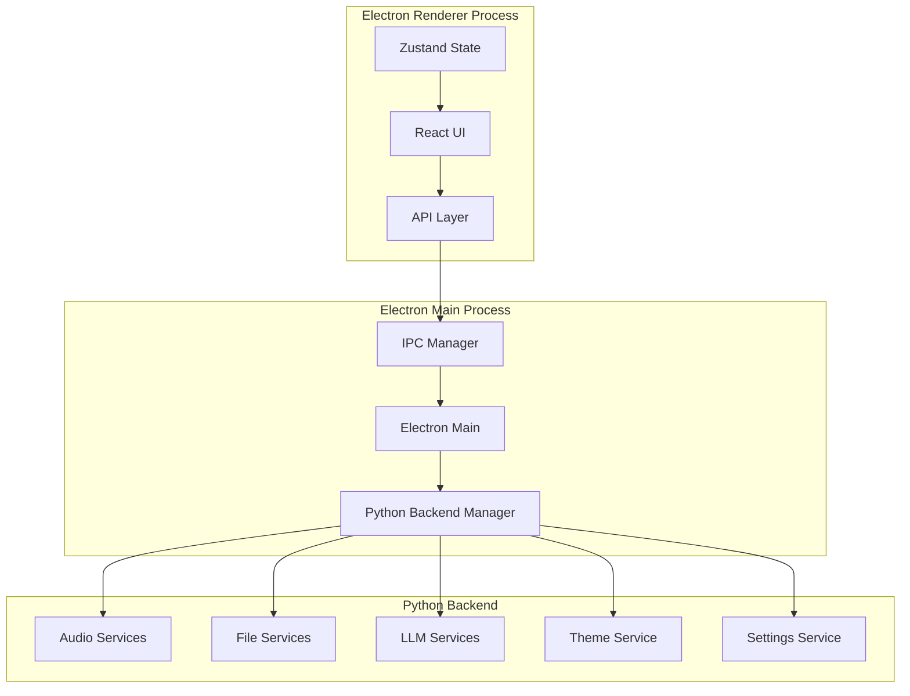
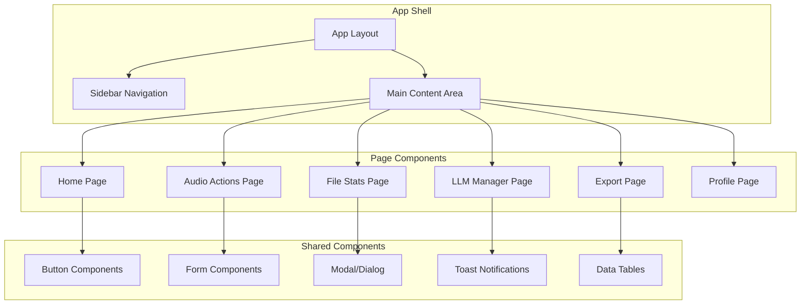

# Design Document - Electron Version Migration

## Overview

This design document outlines the architecture and implementation strategy for migrating the Audio Chat Studio application from PyQt6 to a modern Electron application using React, TypeScript, and shadcn/ui components. The design maintains the existing Python backend services while modernizing the frontend with web technologies.

The migration follows a hybrid architecture where the Electron frontend communicates with the existing Python backend services through IPC (Inter-Process Communication), allowing us to preserve the robust audio processing logic while delivering a modern user experience.

## Architecture

### High-Level Architecture



### Process Architecture

1. **Electron Main Process**: Manages application lifecycle, window creation, and Python backend communication
2. **Electron Renderer Process**: Hosts the React application with modern UI components
3. **Python Backend Process**: Continues to handle audio processing, file operations, and business logic

### Technology Stack

- **Frontend Framework**: React 18 with TypeScript
- **UI Components**: shadcn/ui with Tailwind CSS
- **State Management**: Zustand for global state, React Query for server state
- **Build Tool**: Vite for fast development and optimized builds
- **Desktop Framework**: Electron with context isolation enabled
- **Backend Communication**: IPC/HTTP bridge to existing Python services

## Components and Interfaces

### Frontend Components Architecture



### Core Interface Definitions

#### IPC Communication Interface
```typescript
interface IPCMessage {
  id: string;
  service: string;
  method: string;
  payload: any;
  timestamp: number;
}

interface IPCResponse {
  id: string;
  success: boolean;
  data?: any;
  error?: string;
  timestamp: number;
}
```

#### Audio Service Interface
```typescript
interface AudioService {
  processAudio(filePath: string, options: AudioProcessingOptions): Promise<AudioResult>;
  generateWaveform(filePath: string): Promise<WaveformData>;
  exportAudio(data: AudioExportRequest): Promise<ExportResult>;
  analyzeAudio(filePath: string): Promise<AudioAnalysis>;
}
```

#### File Service Interface
```typescript
interface FileService {
  getFileStats(filePath: string): Promise<FileStats>;
  watchDirectory(path: string): Promise<FileWatcher>;
  validateFile(filePath: string): Promise<FileValidation>;
  getFileMetadata(filePath: string): Promise<FileMetadata>;
}
```

### Component Structure

#### Main Application Components

1. **App.tsx**: Root application component with routing and global providers
2. **Layout.tsx**: Main layout with sidebar and content area
3. **Sidebar.tsx**: Navigation sidebar with shadcn/ui components
4. **Pages/**: Individual page components matching current PyQt6 pages

#### Shared UI Components

1. **Button**: shadcn/ui button variants (primary, secondary, destructive, etc.)
2. **Input**: Form input components with validation
3. **Dialog**: Modal dialogs for confirmations and forms
4. **Toast**: Notification system replacing PyQt6 notifications
5. **Table**: Data display tables with sorting and filtering
6. **Card**: Content containers with consistent styling

## Data Models

### State Management Structure

#### Global State (Zustand)
```typescript
interface AppState {
  // UI State
  currentPage: string;
  sidebarCollapsed: boolean;
  theme: 'light' | 'dark';
  
  // User State
  user: UserProfile | null;
  settings: AppSettings;
  
  // Application State
  isLoading: boolean;
  notifications: Notification[];
  
  // Actions
  setCurrentPage: (page: string) => void;
  toggleSidebar: () => void;
  setTheme: (theme: 'light' | 'dark') => void;
  updateSettings: (settings: Partial<AppSettings>) => void;
}
```

#### Server State (React Query)
```typescript
interface AudioState {
  files: AudioFile[];
  currentFile: AudioFile | null;
  waveformData: WaveformData | null;
  processingStatus: ProcessingStatus;
}

interface ExportState {
  exports: ExportJob[];
  currentExport: ExportJob | null;
  exportHistory: ExportRecord[];
}
```

### Data Transfer Objects

#### Audio Processing DTOs
```typescript
interface AudioProcessingOptions {
  format: string;
  quality: number;
  filters: AudioFilter[];
  metadata: AudioMetadata;
}

interface WaveformData {
  peaks: number[];
  duration: number;
  sampleRate: number;
  channels: number;
}
```

#### File Management DTOs
```typescript
interface FileStats {
  path: string;
  size: number;
  created: Date;
  modified: Date;
  type: string;
  metadata: Record<string, any>;
}
```

## Error Handling

### Error Boundaries
- **Global Error Boundary**: Catches unhandled React errors
- **Page Error Boundaries**: Isolate errors to specific pages
- **Component Error Boundaries**: Protect critical UI components

### IPC Error Handling
```typescript
class IPCErrorHandler {
  static handleError(error: IPCError): void {
    switch (error.type) {
      case 'CONNECTION_LOST':
        // Attempt reconnection to Python backend
        break;
      case 'TIMEOUT':
        // Show timeout notification and retry option
        break;
      case 'VALIDATION_ERROR':
        // Show user-friendly validation messages
        break;
      default:
        // Log error and show generic error message
        break;
    }
  }
}
```

### Python Backend Error Propagation
- Structured error responses from Python services
- Error categorization (user errors vs system errors)
- Graceful degradation when services are unavailable

## Testing Strategy

### Frontend Testing
1. **Unit Tests**: Jest + React Testing Library for components
2. **Integration Tests**: Test IPC communication and state management
3. **E2E Tests**: Playwright for full application workflows
4. **Visual Regression Tests**: Chromatic for UI consistency

### Backend Integration Testing
1. **IPC Communication Tests**: Verify message passing between processes
2. **Python Service Tests**: Ensure existing Python services work with new IPC layer
3. **File System Tests**: Test file operations and permissions

### Testing Structure
```
tests/
├── unit/
│   ├── components/
│   ├── hooks/
│   └── utils/
├── integration/
│   ├── ipc/
│   ├── services/
│   └── state/
├── e2e/
│   ├── workflows/
│   └── pages/
└── fixtures/
    ├── audio/
    └── data/
```

## Security Considerations

### Electron Security
- **Context Isolation**: Enabled to prevent renderer access to Node.js APIs
- **Preload Scripts**: Secure IPC communication through exposed APIs
- **Content Security Policy**: Strict CSP to prevent XSS attacks
- **Node Integration**: Disabled in renderer processes

### IPC Security
```typescript
// Preload script for secure IPC
const electronAPI = {
  // Audio operations
  processAudio: (filePath: string, options: AudioProcessingOptions) => 
    ipcRenderer.invoke('audio:process', { filePath, options }),
  
  // File operations
  selectFile: () => ipcRenderer.invoke('file:select'),
  
  // Settings operations
  getSettings: () => ipcRenderer.invoke('settings:get'),
  updateSettings: (settings: Partial<AppSettings>) => 
    ipcRenderer.invoke('settings:update', settings),
};

contextBridge.exposeInMainWorld('electronAPI', electronAPI);
```

### Data Validation
- Input sanitization for all IPC messages
- File path validation to prevent directory traversal
- Type checking with Zod schemas for runtime validation

## Performance Optimization

### Frontend Optimization
1. **Code Splitting**: Route-based and component-based splitting
2. **Lazy Loading**: Defer loading of heavy components
3. **Memoization**: React.memo and useMemo for expensive operations
4. **Virtual Scrolling**: For large data sets in tables

### IPC Optimization
1. **Message Batching**: Combine multiple operations into single IPC calls
2. **Streaming**: For large data transfers (audio files, waveforms)
3. **Caching**: Cache frequently accessed data in renderer process

### Bundle Optimization
```javascript
// Vite configuration for optimization
export default defineConfig({
  build: {
    rollupOptions: {
      output: {
        manualChunks: {
          vendor: ['react', 'react-dom'],
          ui: ['@radix-ui/react-dialog', '@radix-ui/react-dropdown-menu'],
          audio: ['wavesurfer.js', 'tone'],
        },
      },
    },
  },
});
```

## Migration Strategy

### Phase 1: Foundation Setup
1. Set up Electron + React + TypeScript project structure
2. Implement basic IPC communication with Python backend
3. Create shadcn/ui component library
4. Set up state management with Zustand

### Phase 2: Core UI Migration
1. Migrate main window layout and sidebar
2. Implement navigation system
3. Create basic page shells
4. Set up theme system (dark/light mode)

### Phase 3: Feature Migration
1. Migrate home page with dashboard widgets
2. Implement audio processing pages
3. Migrate export functionality
4. Add file management features

### Phase 4: Advanced Features
1. Implement LLM management interface
2. Add profile and settings pages
3. Integrate notification system
4. Add keyboard shortcuts and native integrations

### Phase 5: Polish and Optimization
1. Performance optimization
2. Error handling improvements
3. Testing and bug fixes
4. Documentation and deployment setup

## Development Workflow

### Project Structure
```
electron-app/
├── src/
│   ├── main/           # Electron main process
│   ├── renderer/       # React application
│   ├── preload/        # Preload scripts
│   └── shared/         # Shared types and utilities
├── python-backend/     # Existing Python services
├── assets/             # Static assets
├── build/              # Build configuration
└── dist/               # Built application
```

### Build Process
1. **Development**: Vite dev server with hot reload
2. **Python Integration**: Automatic Python backend startup
3. **Production Build**: Optimized bundles with Electron Builder
4. **Cross-platform**: Windows, macOS, and Linux builds

This design provides a solid foundation for migrating the Audio Chat Studio application to Electron while maintaining all existing functionality and improving the user experience with modern web technologies.